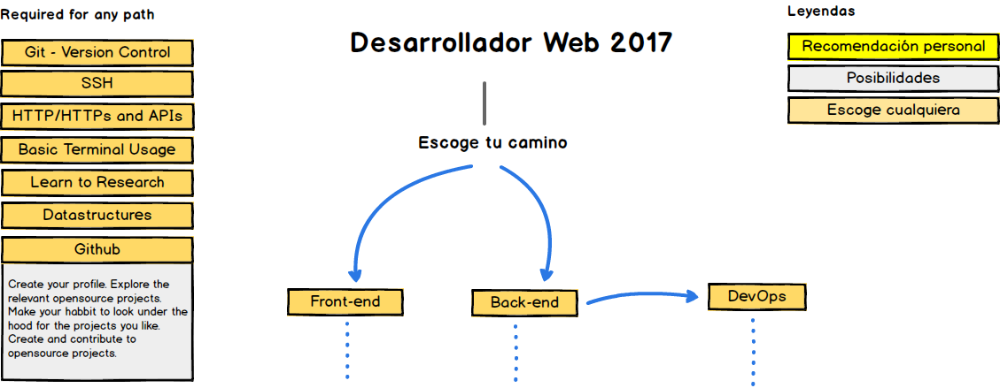

> Mapa para convertirse en un desarrollador web en 2017

Debajo encontrarás un conjunto de imágenes que muestran los caminos y las tecnologías que puedes tomar para convertirte en un desarrollador frontend, backend o devops. Realicé estas imágenes para un antigüo profesor que quería algo para compartir con sus colegas y estudiantes, para darles un poco de perspectiva.

Si crees que puede ser mejorado de alguna manera, por favor hazme una sugerencia.

***

<b> ¿Quieres aprender algo nuevo?</b> Visita <a href="http://hugobots.com">Hugobots</a> Donde le enseño a la gente

***

## 🚀 Introducción

## 🎨 Mapa del Frontend

## 👽 Mapa del Backend

Para el backend personalmente sugiero Node JS y PHP 7 para tiempo completo además he experimentado con Go últimamente y me gusta bastante. Además de estos, si tengo que escoger algún otro, me iría por Ruby. Sin embargo es solo mi preferencia personal, puedes escoger cualquier lenguaje de los que muestro y estará bien.

## 👷 Mapa del DevOps

 

## 🚦 Sugerencia

Si crees que alguno de los mapas, puede ser mejorados, por favor abre un PR con cualquier actualización y publica cualquier problemática. También continuaré mejorando esto, entonces posiblemente quieras seguir/puntuar este repositorio para re visitarlo.

## ☑ Para hacer

- [X] Agregar un mapa Frontend
- [X] Agregar un mapa Backend
- [X] Agregar un mapa DevOps
- [ ] Agregar recursos relevantes para cada uno

## 👬 Contribution

Los mapas fueron construidos usando [Balsamiq](https://balsamiq.com/products/mockups/). El archivo del proyecto puede ser encontrado en  `/ROADMAPS.bmpr`, abrelo en balsamiq, has las modificaciones necesarias, exporta los diagramas a archivos PNG, colocalos en el readme en los lugares relevantes y crea un PR

- Abrir PR con mejoras
- Discutir ideas en las problemáticas
- Riega la palabra
- Escribeme directamente en  kamranahmed.se@gmail.com o en twitter [@kamranahmedse](http://twitter.com/kamranahmedse)

## Licence

